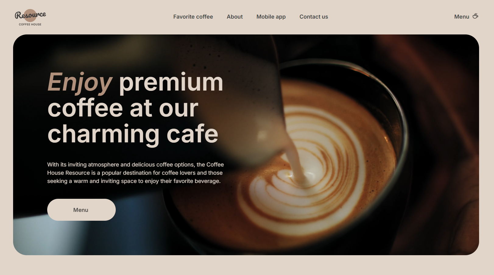
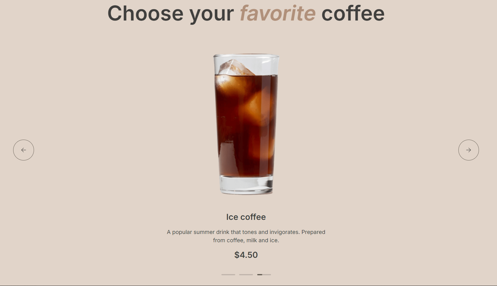
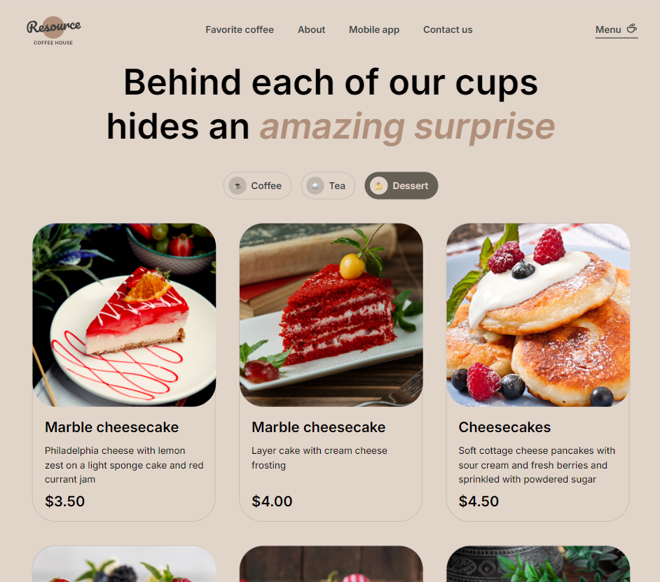
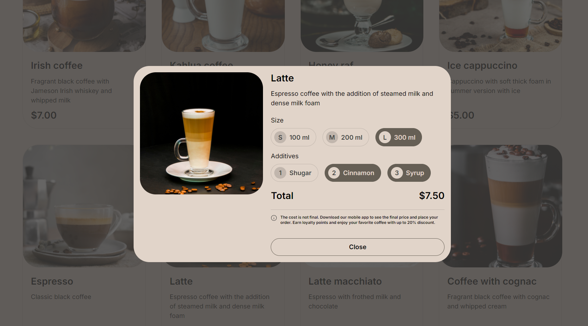

# Coffe House
## Project's Description
Coffee House is an educational project of a website consisting of two pages with responsive design, interactivity and functionality. Done on the [RS School JavaScript / Front-end Course](https://rs.school/courses/javascript-preschool-ru).
## Demo
Checkout Coffe House demo [here](https://whiterabbit8.github.io/coffee-house/).
## Features
* Responsive design
* Burger menu on tablet and mobile versions
* Carousel with coffee on the home page
* Category switching for products on the menu page
* Loading more products by button click on the menu page
* Modal for the selected product on the menu page
## Screenshots

## Technologies
* HTML
* SASS
* JavaScript
* Vite
* BEM